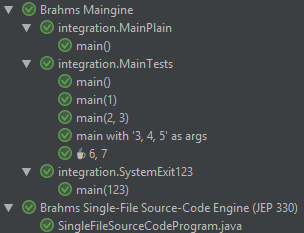

# brahms

[](http://jdk.java.net/11)
[](https://travis-ci.com/sormuras/brahms)
[](https://search.maven.org/search?q=g:%22de.sormuras%22%20AND%20a:%22brahms%22)

This projects offers some proof-of-concept ideas implementing JUnit Jupiter's Extension API and JUnit Platform's
[TestEngine](https://junit.org/junit5/docs/current/user-guide/#launcher-api-engines-custom):



Download the [latest JAR](https://search.maven.org/remote_content?g=de.sormuras&a=brahms&v=LATEST) or depend via Maven:

```xml
<dependency>
  <groupId>de.sormuras</groupId>
  <artifactId>brahms</artifactId>
  <version>{brahms.version}</version>
  <scope>test</scope>
</dependency>
```

or Gradle:

```
testCompile "de.sormuras:brahms:${brahms.version}"
```

Don't want to use the brahms API in your test code?
Add a test runtime dependency will do just fine:

```
testRuntime "de.sormuras:brahms:${brahms.version}"
```

## ☕ Brahms Maingine

Find classes that contain a `public static void main(String[] args)` method
and execute them.

#### Plain

A simple main class will be executed in-process and any exception will cause
the test to be marked as failed.

```java
public class MainPlain {
  public static void main(String... args) {
    // ...
  }
}
```

#### Customize `@Main` execution

Use the `@Main` annotation to customize the execution: pass arguments, set a
display name, fork a `java` process with different VM parameters. Any exception
will cause the test to be marked as failed.

```java
public class MainTests {
  // No-args test run
  @Main

  // Single argument test run
  @Main("1")

  // Multiple arguments test run
  @Main({"2", "3"})

  // Custom display name of test run
  @Main(
      displayName = "main with '${ARGS}' as args",
      value = {"3", "4", "5"})

  // Fork VM and launch with specific java/VM options
  @Main(
      displayName = "☕ ${ARGS}",
      value = {"6", "7"},
      java = @Java(options = {"-classpath", "${java.class.path}"}))

  public static void main(String... args) {
    var message = args.length == 0 ? "<no-args>" : String.join(", ", args);
    System.out.println("MainTests: " + message);
  }
}
```

When forking, you may also expect a non-zero exit value:

```java
public class SystemExit123 {

  @Main(
  	value = "123",
  	java = @Java(expectedExitValue = 123, options = {"-classpath", "${java.class.path}"}))              
  public static void main(String... args) {
    System.exit(Integer.parseInt(args[0]));
  }
}
```

## 📜 Brahms Single File Source Code TestEngine

Find `.java` source files that contain a `public static void main(String[] args)` method
and execute them. For details see [JEP 330](http://openjdk.java.net/jeps/330).

```java
class SingleFileSourceCodeProgram {
  public static void main(String... args) {
    // ...
  }
}
```
